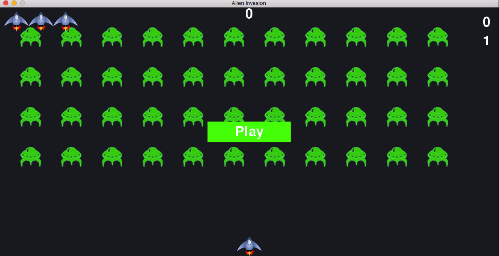

# Alien invasion arcade game 

## Summary
This project was inspired by famous book "Python Crash Course: A Hands-On, Project-Based Introduction to Programming" by Eric Matthes.
In a nutshell it is a classic type arcade game based on destroying UFOs in a far far away universe. Game is written using `pygame` python 
package. Enjoy it!

## Run game
```bash
~ python alien_invasion.py
```

## Demo



## Run unittests
Run `pytest -v` from shell in the root directory of the repository.

## Contributing

- clone the repository
- configure Git for the first time after cloning with your name and email
  ```bash
  git config --local user.name "Volodymyr Yahello"
  git config --local user.email "vyahello@gmail.com"
  ```
- `python3.6` is required to run the code
- run `pip install -r requirements.txt` to install all require python packages
